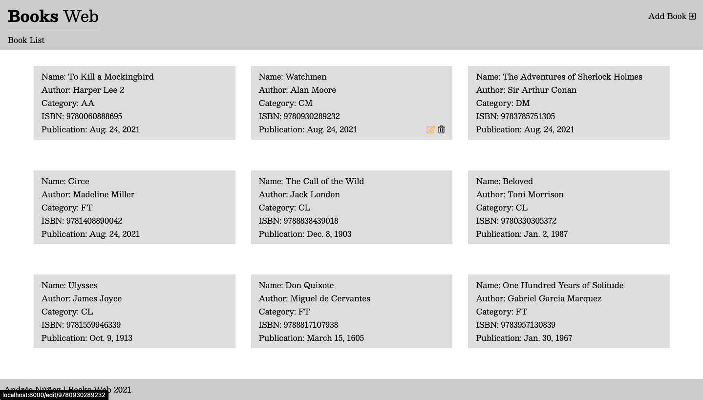
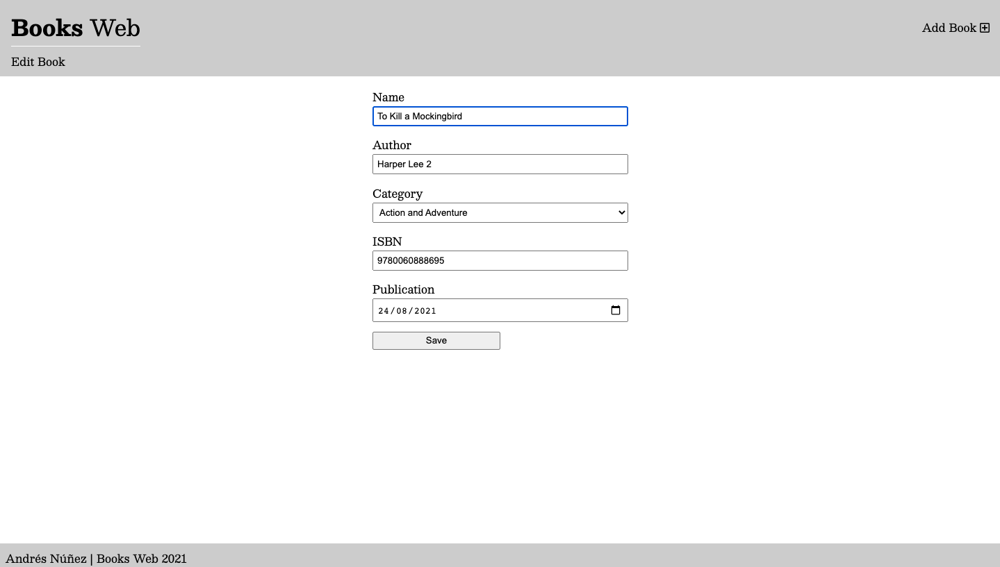
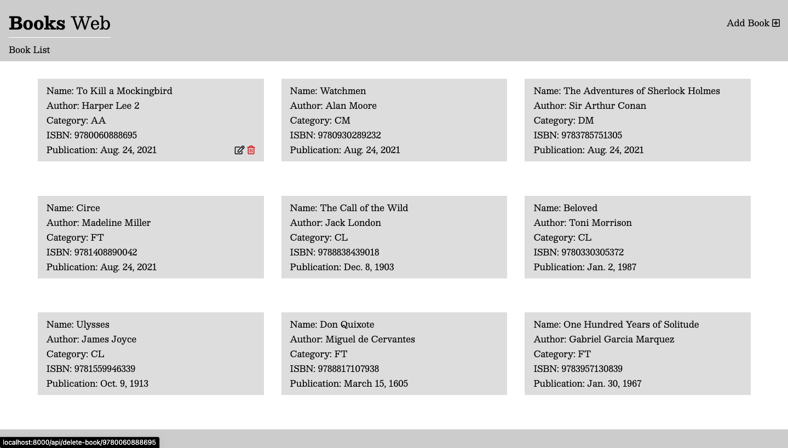
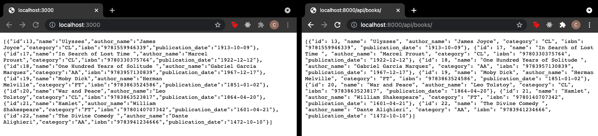

## BooksWeb

Django Web app with REST and Server with ExpressJS

## Instalación de dependencias de Python

```bash
pip install -r requirements.txt
```

## Apps

'/booksweb' Django web app

''

NodeJS version: v16.4.2

# Rutas 

- Lista de libros - GET

`/`

- Crear libro - POST

`/new`

- Editar libro - PUT

`/edit/<int:isbn>/`>

# Rutas API

- Lista de libros en formato JSON - GET

`/api/books/`

- Libro por id - GET

`/api/book/<int:id>/`

- Crear libro - POST

`/api/create-book/`

- Editar libro - PUT

`update-book/<int:isbn>`

- Borrar libro - DELETE

`delete-book/<int:isbn>`

# Admin

- User: superusuariopy
- Password: pysuper123
- Ruta:

`/admin`

# Screenshots

## Vista de lista



## Edición



## Eliminar ítem



## Consumir API rest con NodeJS y Express

