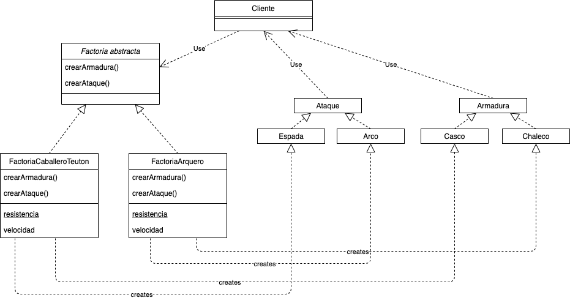

# BooksWeb

Django Web app with REST and Server with ExpressJS

## Instalación de dependencias de Python

```bash
pip install -r requirements.txt
```

## Apps

'/booksweb' Django Books web app

'/node_express_server' Consume Django API REST

# Rutas 

- Lista de libros - GET: `/`

- Crear libro - POST: `/new`

- Editar libro - PUT: `/edit/<int:isbn>/`>

# Rutas API

- Lista de libros en formato JSON - GET: `api/books/`

- Libro por id - GET: `api/book/<int:id>/`

- Crear libro - POST: `api/create-book/`

- Editar libro - PUT: `api/update-book/<int:isbn>`

- Borrar libro - DELETE: `api/delete-book/<int:isbn>`

# Admin Django

- User: superusuariopy
- Password: pysuper123
- Ruta: `/admin`

# Screenshots

## Vista de lista


## Edición


## Eliminar ítem


### Consumir API rest con NodeJS y Express


# Abstract Factory



En la imágen anterior se presenta la implementación en el patrón de diseño Factoría Abstracta de dos unidades, Caballero y Arquero, del videojuego Age of Empires.

La factoría abstracta funciona de tal manera que, en el caso del ejemplo, se encapsulan dos factorías individuales `FactoriaCaballeroTeuton` y `FactoriaArquero`.

`Espada` y `Arco`, son elementos del mismo tipo, que a su vez tienen como interfaz a `Ataque`, pero `Espada` y `Arco` son implementaciones de factorías diferentes, `FactoriaCaballeroTeuton` y `FactoriaArquero`, respectivamente. Estas dos últimas hacen las implementaciones indicadas mediante la factoría abstracta.